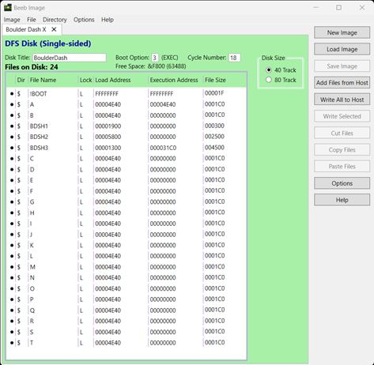
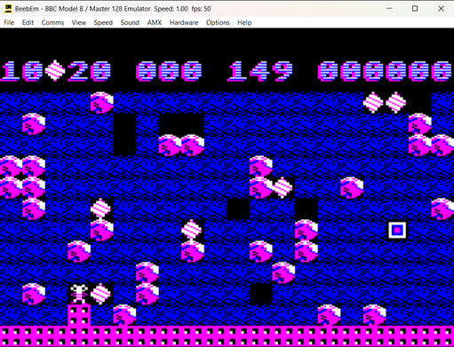
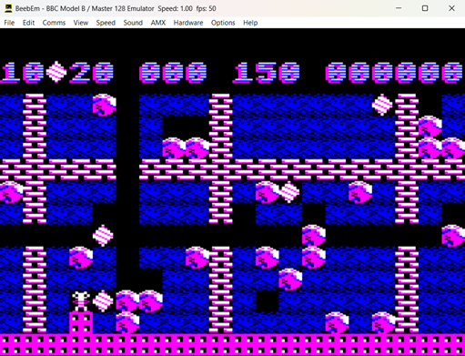
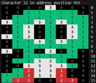

# BBC/Electron Boulder Dash enhancements and utilities

This repository includes the following:
- Enhanced version of the Boulder Dash game (6502 assembler and build programs) which allows new caves to be played. The caves and difficulty levels from the original game are also supported.
- Cave file generator which creates caves from Boulder Dash cave format files (BDCFFs) developed by fans of the game.
- Sprite set decoder for converting bytes into their sprite tiles and displaying the results.

More information about this project can be found at: [Stardot: More Boulder Dash!](https://stardot.org.uk/forums/viewtopic.php?t=28372)

## Enhancements

### Loading cave files
Caves are no longer held within the main program, instead they are defined as individual cave files (letters A-T) which are loaded into the game. This allows completely new caves to be created and played with the original game engine.



- Each cave file is a single, standalone cave and contains everything needed to use it with the game engine, including its parameters (diamonds needed, cave time etc) and map layout.
- A cave file comprises 48 bytes for cave parameters and 400 bytes for the map.

```cave parameters
1 byte Diamond value
1 byte Diamond extra value
5 bytes Diamonds required for each difficulty level
5 bytes Cave time for each difficulty level
1 byte Amoeba or Magic Wall time
1 byte Initial fill tile - usually dirt, sometimes space
5 bytes Random seed for pseudo-random routine for each difficulty level
4 bytes Tile probability for up to four tiles / objects
4 bytes Tile / object related to the probability
1 byte Intermission indicator (0 for normal cave, 1 for intermission / bonus cave)
3 bytes Cave colour scheme x3 colours
2 bytes Rockford start row and column
2 bytes Rockford exit row and column
13 bytes Unused / future use / cave labels
```

In the map layout of 400 bytes, each tile (dirt, boulder, diamond etc) is a nibble, so a single byte represents two tiles. There are 800 tiles for the interior of the cave (20 rows by 40 columns), excluding the top and bottom steel walls which are plotted by the game engine.

See [Stardot: More Boulder Dash!](https://stardot.org.uk/forums/viewtopic.php?t=28372) for details about the cave editors which allow new caves to be created or existing ones tweaked (usually to make them a bit easier)!

### Original game difficulty levels
The original version of the game is preserved by having the difficulty levels use the 'standard' pseudo-random method of plotting boulders, diamonds, etc in a cave (same method used by the original Boulder Dash developer, Peter Liepa).

- This is a compact approach for creating the original caves and replaces the method used by the coder of the Acorn conversion, Andrew Bennett.
- A pseudo-random value is calculated by a function using the seed value for the cave difficulty level. It is compared with each of the 4 tile probability values to determine whether to draw those tiles or not.
- The parameters needed for the pseudo-random function are held in cave files. The map data is used for the non-random 'fixed' tiles (often walls).
- If the cave uses this method of creating the layout, the pseudo-random tiles are applied first, followed by the non-random tiles required to complete the map.
- The non-random tiles are plotted over those produced by the pseudo random method. To support this, 'null' tiles are used in the map data which means preserve the (pseudo-random) tile already drawn.
- Entirely new caves can be created using this method if required. It is also possible to mix caves which use the pseudo-random method with those that do not.

Below is original cave B, one example with just the pseudo-random objects, and the other with the extra 'fixed' elements to complete the cave with.





### Code and build
The assembler code is compiled using ACME and an SSD file including the original caves is produced by a Python build script. The caves can be replaced with others if needed.
- [main.asm is the game engine assembler code](./asm/main.asm)
- [BDcompileasm.py is the Python SSD file build script](./BDcompileasm.py)
- [BDoriginalcaves folder has the cave files used in the SSD](./BDoriginalcaves/)

The output from this process is kept in sub-folders.
- [Build output includes file BDSH3 compiled from main.asm](./output/build/)
- [SSD output contains the complete game](./output/ssd)


## Cave file generator
This is a Python program for creating playable caves from Boulder Dash cave format files (BDCFFs) which can be found online. A substantial collection can be found at [Arno's Boulder Dash fansite](https://www.boulder-dash.nl/).

### Boulder Dash cave format files
BDCFFs are a type of structured file which documents the cave parameters and map layout. There are 2 types supported by this program.
- Original-type where caves are created using pseudo-random generation of tiles (boulders, diamonds etc). These usually also have a set of base tiles (often walls) which are defined with object instructions, e.g. "FillRect=8 8 11 11 DIRT SPACE".
- Map-type where caves are defined by characters which map to tiles, e.g. 'd' for diamond, 'r' for rock. The pseudo-random generation of tiles is not used, which means different skill levels have the same map layout. Only the parameters like number of diamonds needed and cave time may be different for each level.

### Generator features
The cave generator does the following:
- Produces all the cave files for the BBC/Electron Boulder Dash game engine from a single BDCFF. This is done by parsing and mapping the data in the BDCFF files.
- Combines these caves with the game engine (created earlier) and other startup code to produce an SSD file ready to play.
- Optionally allows the original sprites to be replaced with different ones (some sprite files are included in this repository).
- Produces a JSON file for the BDCFF (JSON being a modern structured and readable alternative).
- Produces multiple SSD files if given multiple BDCFFs.

A [config file](./config/config.json) is used to define the elements for mapping purposes and contains the data needed to produce SSD files. Colours are also mapped where possible. Where there is no colour mapping possible, a colour scheme for the cave is used instead.

Colours are used as follows for the sprites in the game - there are 3 definable colour groups applied to each cave used to paint the elements (black is always present).
-  Group 1 for most of titanium walls, rocks, amoeba; part of rockford, diamonds
-  Group 2 earth
-  Group 3 most of walls, rockford; part of rocks, diamonds

The butterflies and fireflies contain a bit of each colour.

### Usage
- The game engine and related startup code used in this build is taken from the [BDcode folder](./BDcode/).
- If there is a new assembled program which should be used for cave generation, replace [BDSH3](./BDcode/BDSH3) with the compiled version from the [build output folder](./output/build/)
- Copy one or more BDCFFs into the [BDconvert folder](./BDconvert/).
- Optionally replace the original sprites with a custom set by amending the SPRITES_FILE value in the [BDcavegen.py python script](./BDcavegen.py) to point to a sprite file in [sample sprites folder](./BDsprites/). 
- Run the script.
- The resulting SSDs are located in [SSD output](./output/ssd). Converted BDCFFs are moved to the [done sub-folder](./BDconvert/done/)


## Sprite set decoder
This is a Python program for displaying the sprites used in the game. It decodes the bytes for each sprite and outputs the result in text format showing the colours and their codes.



Although largely replaced with a full sprite editor now, this program will accept a csv file with sprite byte values to display and output to a sprite set file. See [DecodeTiles.py](./DecodeTiles.py) for more information.

See [Stardot: More Boulder Dash!](https://stardot.org.uk/forums/viewtopic.php?t=28372) for details about the sprite editor.


## Acknowledgements
The information and code shared by the following developers and sources is gratefully acknowledged:

- [Disassembly of the original game](https://github.com/TobyLobster/Boulderdash), by TobyLobster
- [Getting the cave-load method to work](https://stardot.org.uk/forums/viewtopic.php?t=28372), by billcarr2005
- [Arno's Boulder Dash fansite](https://www.boulder-dash.nl/)
