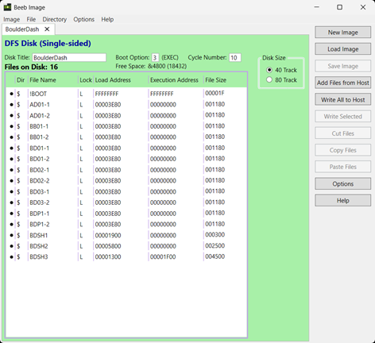

# BBC/Electron Boulder Dash enhancements and utilities

This repository includes the following:
- Enhanced version of the Boulder Dash game (6502 assembler and build programs) which allows new caves to be played. The caves and difficulty levels from the original game are also supported.
- Addition of the new Boulder Dash 2 elements, slime and growing wall to support that version of the game
- Addition of bomb element, zero-gravity and non-steelwall borders in the homebrew '+1' version
- Cave file generator which creates caves from Boulder Dash cave format files (BDCFFs) developed by fans of the game.
- Cave editor to load and edit caves or create completely new ones
- Sprite editor to change the game sprites and tiles
- Sprite set decoder for converting bytes into their sprite tiles and displaying the results.

More information about this project can be found at: [Stardot: More Boulder Dash!](https://stardot.org.uk/forums/viewtopic.php?t=28372)

## Enhancements

### Loading cave files
Caves are no longer held within the main program, instead they are defined as individual cave files (letters A-T) which are loaded into the game. This allows completely new caves to be created and played with the original game engine.



- Each cave file is a single, standalone cave and contains everything needed to use it with the game engine, including its parameters (diamonds needed, cave time etc) and map layout.
- A cave file comprises 48 bytes for cave parameters and 400 bytes for the map.

```cave parameters
1 byte   Diamond value
1 byte   Diamond extra value
5 bytes  Diamonds required for each difficulty level
5 bytes  Cave time for each difficulty level
1 byte   Amoeba or Magic Wall time
1 byte   Initial fill tile - usually dirt, sometimes space
5 bytes  Random seed for pseudo-random routine for each difficulty level
4 bytes  Tile probability for up to four tiles
4 bytes  Tile related to the probability
1 byte   Intermission indicator (0 for normal cave, 1 for intermission / bonus cave)
3 bytes  Cave colour scheme x3 colours
2 bytes  Rockford start row and column
2 bytes  Rockford exit row and column
1 byte   Slime permeability (Introduced in Boulder Dash 2)
4 bytes  Additional tile below the one generated by pseudo-random routine (For Boulder Dash 2 caves C, K)
1 byte   Number of bombs available: 0 = no bombs, otherwise number of bombs available (Introduced in homebrew BD+1)
1 byte   Zero-gravity time: 0 = always gravity/normal, 1-$fe = time until gravity back on, $ff = always zero gravity (Introduced in homebrew BD+1)
1 byte   Border tile: 0 = space, 1 = earth, 2 = wall, 3 = 'standard' steelwall tile, other values can be used. Is just applied to the top and bottom rows as the side borders are specified in the cave file (Introduced in homebrew BD+1)
5 bytes  For future use
```

In the map layout of 400 bytes, each tile (dirt, boulder, diamond etc) is a nibble, so a single byte represents two tiles. There are 800 tiles for the interior of the cave (20 rows by 40 columns), excluding the top and bottom steel walls which are plotted by the game engine.

### Original game difficulty levels
The original version of the game is preserved by having the difficulty levels use the 'standard' pseudo-random method of plotting boulders, diamonds, etc in a cave (same method used by the original Boulder Dash developer, Peter Liepa).

- This is a compact approach for creating the original caves and replaces the method used by the coder of the Acorn conversion, Andrew Bennett.
- If the cave uses this method to create the layout, the non-random 'fixed' tiles are applied first, followed by pseudo-random generated tiles which are plotted over any of the non-fixed or 'null' tiles.
- A pseudo-random value is calculated by a function using the seed value for the cave difficulty level. It is compared with each of the 4 tile probability values to determine whether to draw those tiles or not.
- The parameters needed for the pseudo-random function are held in cave files. The map data is used for the non-random 'fixed' tiles (e.g. walls).
- Entirely new caves can be created using this method if required. It is also possible to mix caves which use the pseudo-random method with those that do not.

Below is original cave B. The fixed tiles are the walls and passage-ways of spaces. All the other tiles are plotted using the pseudo-random method. Where no random tile is determined in a tile position, a default is used usually the dirt tile.


### Code and build
The assembler code is compiled using ACME and an SSD file including the caves is produced by a Python build script. Amend the `SSD_NAME` value in this script to switch between producing Boulder Dash 1, 2, etc.
- [main.asm is the game engine assembler code](./asm/main.asm)
- [BDcompileasm.py is the Python SSD file build script](./BDcompileasm.py)
- [BoulderDash01 folder has the cave files for Boulder Dash](./caves/BoulderDash01/)
- [BoulderDash02 folder has the cave files for Boulder Dash 2](./caves/BoulderDash02/)

The output from this process is kept in sub-folders.
- [Build output includes file BDSH3 compiled from main.asm](./output/build/)
- [SSD output contains the complete game](./output/ssd)

## Cave file generator

This is a Python program for creating playable caves from Boulder Dash cave format files (BDCFFs) which can be found online. A substantial collection can be found at [Arno's Boulder Dash fansite](https://www.boulder-dash.nl/).

### Boulder Dash cave format files
BDCFFs are a type of structured file which documents the cave parameters and map layout. There are 2 types supported by this program.
- Original-type where caves are created using pseudo-random generation of tiles (boulders, diamonds etc). These usually also have a set of base tiles (often walls) which are defined with object instructions, e.g. "FillRect=8 8 11 11 DIRT SPACE".
- Map-type where caves are defined by characters which map to tiles, e.g. 'd' for diamond, 'r' for rock. The pseudo-random generation of tiles is not used, which means different skill levels have the same map layout. Only the parameters like number of diamonds needed and cave time may be different for each level.

### Generator features
The cave generator does the following:
- Produces all the cave files for the BBC/Electron Boulder Dash game engine from a single BDCFF. This is done by parsing and mapping the data in the BDCFF files.
- Combines these caves with the game engine (created earlier) and other startup code to produce an SSD file ready to play.
- Optionally allows the original sprites to be replaced with different ones (some sprite files are included in this repository).
- Produces a JSON file for the BDCFF (JSON being a modern structured and readable alternative).
- Produces multiple SSD files if given multiple BDCFFs.

A [config file](./config/config.json) is used to define the elements for mapping purposes and contains the data needed to produce SSD files. Colours are also mapped where possible. Where there is no colour mapping possible, a colour scheme for the cave is used instead.

Colours are used as follows for the sprites in the game - there are 3 definable colour groups applied to each cave used to paint the elements (black is always present).
-  Group 1 for most of titanium walls, rocks, amoeba; part of rockford, diamonds
-  Group 2 earth
-  Group 3 most of walls, rockford; part of rocks, diamonds

The butterflies and fireflies contain a bit of each colour.

### Usage
- The game engine and related startup code used in this build is taken from the [code folder](./code/).
- If there is a new assembled program which should be used for cave generation, replace [BDSH3](./code/BDSH3) with the compiled version from the [build output folder](./output/build/).
- Copy one or more BDCFFs into the [convert folder](./convert/).
- Optionally replace the original sprites with a custom set by amending the SPRITES_FILE value in the [BDcavegen.py python script](./BDcavegen.py) to point to a sprite file in [sample sprites folder](./sprites/). 
- Run the script.
- The resulting SSDs are located in [SSD output](./output/ssd). Converted BDCFFs are moved to the [done sub-folder](./convert/done/).

## Cave editor
An easy way to create or edit a cave is to use the [cave editor](./editor/). The editor includes a help page which lists the main functions and the keys needed to use them.


Press a key to close the help screen then choose a cave to edit (A-P are the main caves, Q-T are the intermission / bonus caves). There are two main sections in the editor, the cave map at the top and the parameters at the bottom.


The map in the top section represents what the cave will be like when the game is played.

The parameter section is divided into sub-sections.
- The first line includes a count of the number of diamonds on the cave, the cave letter, name, and colour selection.
- The next section is where the diamond and bonus value, amoeba / magic wall milling time, total diamonds required, and time allowed are edited. The latter two parameters may be different per level 1 to 5.
- The section following is where the 'random' parameters are set for the caves that are designed to use them (optional). There is a random seed value for each level. Four different tiles with their probabilities can be edited.
- The final section is where the tiles / elements are selected.

### Editing the map and parameters
- Select a cave to edit, either from the initial prompt or with `SHIFT + L` to load one.
- Choose the tile / element to plot with the `Z X` keys or use their shortcut keys.
- Navigate across the map with the cursor keys and press `SPACE` to plot a tile. `DELETE` will remove it.
- Draw multiple tiles quickly by holding down `CTRL` and navigating.
- Press `E` to edit the parameters (toggles between map / parameters).
- Use the left / right keys to navigate to a parameter and up / down to amend its value.
- When complete, choose `SHIFT + S` to save.

### Keys used in the editor
| Status | Meaning |
| ------ | ------- |
| `Q W P L` or cursor keys | Navigation keys for left, right, up, down. Used in map and parameter edit modes |
| `SPACE` or `CTRL` | Draws the selected tile on the map. Hold down `CTRL` with the navigation keys to plot a line of tiles |
| `0 to 9 and R F N` | Selects tiles for space, earth, wall, steel wall, diamond, boulder, firefly, amoeba, butterfly, magic wall, Rockford-start, finish, null-tile |
| `Z X` | Select tiles by cycling through them |
| `F1 F2 F3` | Change the cave colours, 3 different colours can be chosen |
| `E` | Toggles between map and parameter edit mode |
| `SHIFT + S` | Saves all edits on the cave |
| `SHIFT + L` | Load a new cave |
| `DELETE` | Remove tile which becomes a space |
| `SHIFT + DELETE` | Clears a cave with spaces. Holding down `CTRL` with these keys clears the cave with the currently selected tile |
| `M` | Make a new cave with generated tiles using the level 1 'random' parameters. The cave should have null tiles which will be replaced with generated tiles. This provides a shortcut method of producing a new cave which can be further edited |
| `SHIFT 1 to 5` | View what a cave will look like across levels 1 to 5 when the 'random' generated tiles are used. The level 1 to 5 'random' parameters provide the values used to decide whether to plot a particular tile or not. The base cave should include null tiles which is where generated tiles will appear, but unlike the above, these are preserved in the cave map. After viewing, press a key to resume editing |
| `T` | Toggles view of start (Rockford) and exit tiles |
| `C` | Change cave name |
| `H` | View help page |

## Sprite editor
The [sprite editor](./editor/) allows new sprites to be created and used in the game. Like the cave editor, it includes a help page, reached by pressing `H`, which shows the main functions and keys used.


The full sprite set is displayed on the bottom of the screen and sprites are selected from there. A selected sprite is edited on the top part of the screen.


- Edit an existing spriteset by first loading it with `SHIFT + L`.
- Use the cursor keys to navigate to a sprite and press `E` to begin changing it. 
- Here the cursor keys are used with `1 2 3` to change a pixel colour and `SPACE` to plot it. `DELETE` will unplot.
- When done, press `E` and select the next sprite to edit.
- Repeat for all sprites and save the spriteset with `SHIFT + S`.
- Enter the file name to save to. Entering a new file name allows a new spriteset to easily be created from an existing one.

There are many useful functions included in the editor. Highlights include the `A` animation function (e.g. select Rockford and press `A` to see this subset animate); the essential copy / paste functions; and the shift sprite up / down / left / right function. The help page `H` shows the functions available.

To play with a different spriteset, choose the option to change the sprites when the game is started via the menu, then enter the name of the spriteset file to play with. Below are a couple of examples.


Unrelated to the sprite editor, there is a sprite decoder utility program for displaying the sprites used in the game. It decodes the bytes for each sprite and outputs the result in text format showing the colours and their codes.


Although largely replaced with a full sprite editor now, this program will accept a csv file with sprite byte values to display and output to a sprite set file. See [DecodeTiles.py](./DecodeTiles.py) for more information.

## Acknowledgements
The information and code shared by the following developers and sources is gratefully acknowledged:

- [Disassembly of the original game](https://github.com/TobyLobster/Boulderdash), by TobyLobster
- [Getting the cave-load method to work](https://stardot.org.uk/forums/viewtopic.php?t=28372), by billcarr2005
- [Cave editor / construction set](https://stardot.org.uk/forums/viewtopic.php?t=28372), by Cybershark
- [Sprite editor to change the game characters / tiles](https://stardot.org.uk/forums/viewtopic.php?t=28372), by Cybershark
- [Arno's Boulder Dash fansite](https://www.boulder-dash.nl/)
